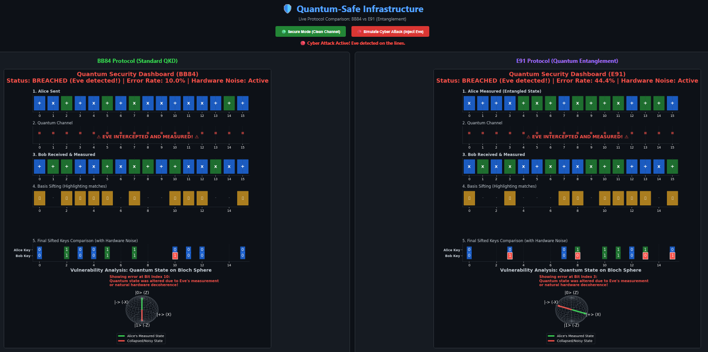

# 🛡️ Quantum-Safe Infrastructure & QKD Analyzer


An advanced cloud-native system designed to simulate, analyze, and visualize Quantum Key Distribution (QKD) protocols. The project bridges the gap between quantum physics and modern cloud infrastructure, providing an interactive dashboard to monitor quantum channels, detect cyber-attacks (Man-in-the-Middle), and simulate physical hardware noise.

## 📊 Live Analysis Dashboard
The interactive control center allows side-by-side comparison of standard QKD vs. Entanglement-based protocols under active cyber-attack simulations.



## 🚀 Core Capabilities

### ⚛️ Quantum Engineering & Security
* **Dual-Protocol Engine:** Supports both **BB84** (Prepare & Measure) and **E91** (Quantum Entanglement via EPR pairs) protocols.
* **Physical Noise Modeling:** The simulator is not sterile. It utilizes `qiskit_aer.noise` to inject natural hardware decoherence (Depolarizing Errors) into the quantum gates, establishing a realistic ~3% baseline Quantum Bit Error Rate (QBER).
* **Real-Time Intrusion Detection:** Visually demonstrates how a third-party measurement (Eve) collapses the wave function and breaks quantum entanglement, automatically flagging the channel as "Breached".

### ☁️ Cloud & DevOps Infrastructure
* **Infrastructure as Code (IaC):** Full AWS environment provisioning (EC2, Security Groups, Networking) automated via **Terraform**.
* **Containerized Microservices:** The Python/Flask backend and Qiskit engine are bundled into a highly optimized, cross-platform **Docker** container, managed by **Docker Compose**.
* **Continuous Integration (CI/CD):** Integrated **GitHub Actions** pipeline that automatically builds the Docker image and runs environment health checks on every push to the `main` branch.

## 🏗️ Architecture Stack
1. **Infrastructure Layer:** AWS, Terraform, GitHub Actions.
2. **Logic & Quantum Layer:** Python, Flask, IBM Qiskit (Aer Simulator).
3. **Visualization Layer:** Matplotlib, HTML/CSS/JS (Dark Mode UI).

## 🛠️ Quick Start (Run Locally)

Deploying the entire simulation environment requires just one command via Docker Compose:

```bash
# 1. Build and start the container in detached mode
docker-compose up -d --build